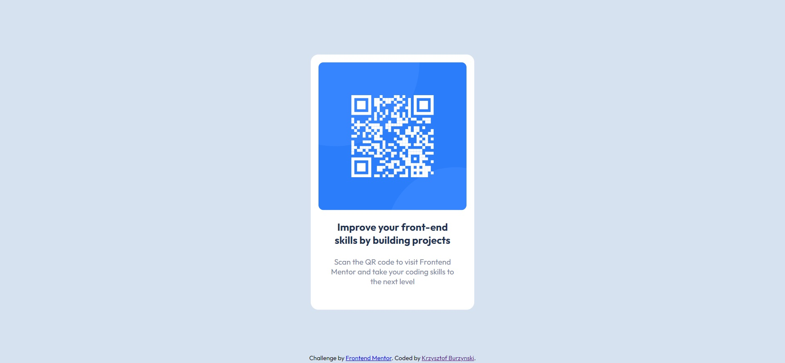

# Frontend Mentor - QR code component

## Table of contents
* [General info](#general-info)
* [Technologies](#technologies)
* [Screenshots](#screenshots)

## General info
This project was realized as a challenge of Frontend Mentor platform. [Click here](.https://www.frontendmentor.io/challenges/qr-code-component-iux_sIO_H), to preview design of the QR code component or check design files in this repository.

## Technologies
* HTML5
* CSS3

## Screenshots

